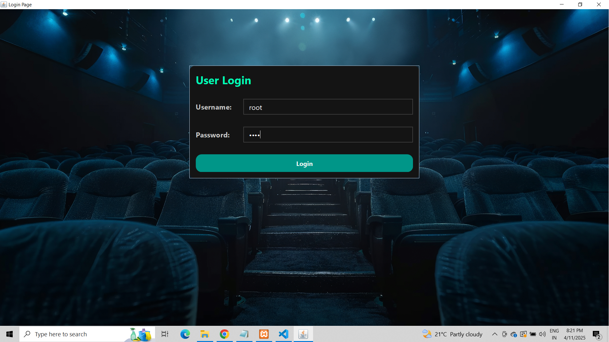
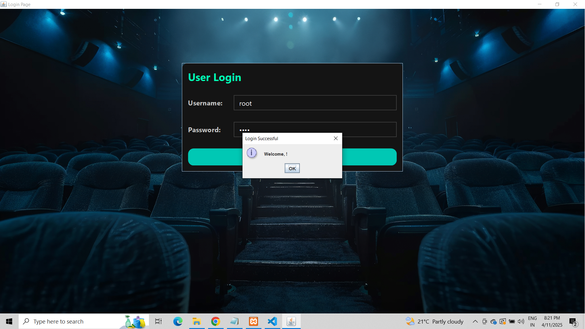
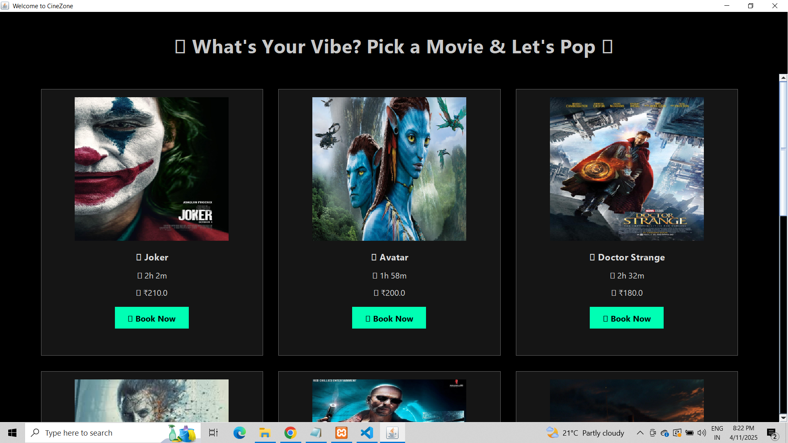
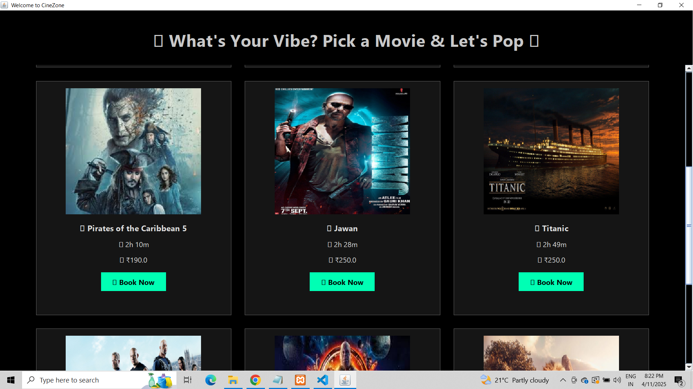
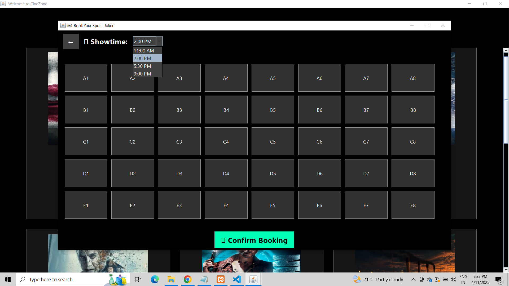
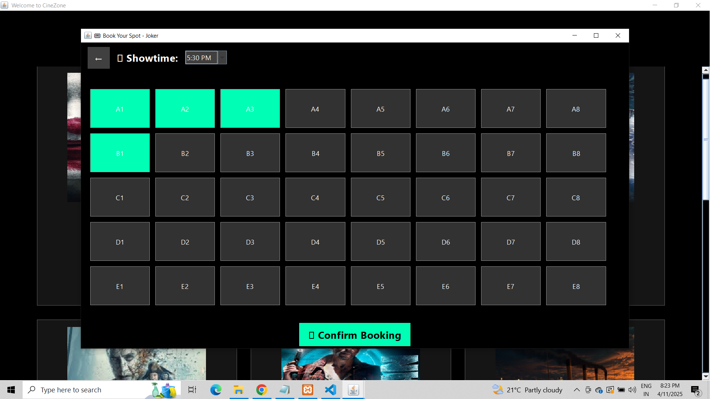
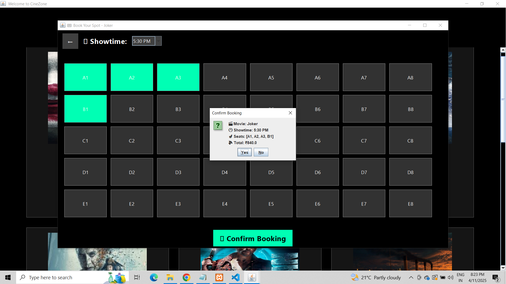
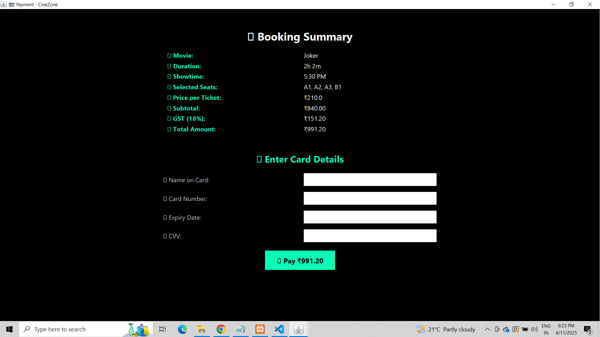
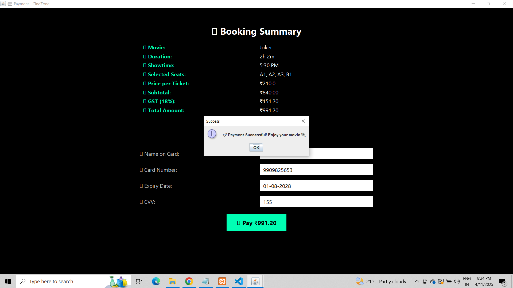

# 🎬 Cinemax – Movie Ticket Booking System

A Java Swing desktop application for seamless movie ticket booking with interactive seat selection, secure payments, and instant digital ticket generation.

# 📑 Table of Contents

Features

Tech Stack

Installation & Setup

Usage

Screenshots

Project Structure

Database Schema

References

Author

# ✨ Features

Secure Authentication – User login with database validation.

Movie Library – Browse movies with posters, genres, duration, and price.

Seat Booking System – Real-time availability with visual seat map.

Payment Gateway Simulation – Card payments with GST calculation.

Digital Ticket Generation – Instant confirmation stored in DB with transaction history.

# 🛠 Tech Stack

Language: Java (Swing for GUI)

Database: MySQL (via JDBC)

GUI Components: JFrame, JPanel, JButton, JLabel, JComboBox, JCheckBox

IDE Support: Eclipse / IntelliJ IDEA / NetBeans

# ⚙️ Installation & Setup
# 1. Clone the Repository
git clone https://github.com/sohailaamir/Movie-Booking.git
cd cinemax-booking

# 2. Configure the Database

Create the database and initial tables:

CREATE DATABASE cinemax;
USE cinemax;

CREATE TABLE users (
  username VARCHAR(50) PRIMARY KEY,
  password VARCHAR(50)
);
INSERT INTO users VALUES ('root', 'root');

Additional tables (movies, bookings, payments) are available in the database.sql file.

# 3. Set Database Credentials

Edit your Java connection settings:

String dbUrl = "jdbc:mysql://localhost:3306/cinemax";
String dbUser = "root";
String dbPassword = "yourpassword";

# 4. Run the Project

Open the project in your IDE → Run Main.java

Or compile manually:

javac *.java
java Main

▶️ Usage

Launch the application → Log in using your credentials.

Browse movies → Select a movie & showtime.

Choose your seats → Confirm booking.

Enter payment details → Complete the payment.

Receive your digital ticket instantly!

# 📸 Screenshots

Screenshots available in the /images
 folder.

# Login Page:

# Movie Selection Page:

# Seat Booking:

# Payment Gateway:

Digital Ticket Confirmation

# 📂 Project Structure
cinemax-booking/
│
├── src/
│   ├── LoginForm.java
│   ├── MovieSelection.java
│   ├── BookMovie.java
│   ├── PaymentPage.java
│   └── resources/ (images, posters)
│
├── database.sql
└── README.md

# 🗄 Database Schema

 
Click to view schema

-- Users
CREATE TABLE users (
  username VARCHAR(50) PRIMARY KEY,
  password VARCHAR(50)
);

-- Movies
CREATE TABLE movies (
  movie_id INT AUTO_INCREMENT PRIMARY KEY,
  title VARCHAR(100),
  category VARCHAR(50),
  duration INT,
  price DECIMAL(10,2)
);

-- Bookings
CREATE TABLE bookings (
  booking_id INT AUTO_INCREMENT PRIMARY KEY,
  username VARCHAR(50),
  movie_id INT,
  seats VARCHAR(50),
  booking_date TIMESTAMP DEFAULT CURRENT_TIMESTAMP
);

-- Payments
CREATE TABLE payments (
  payment_id INT AUTO_INCREMENT PRIMARY KEY,
  booking_id INT,
  amount DECIMAL(10,2),
  gst DECIMAL(10,2),
  payment_date TIMESTAMP DEFAULT CURRENT_TIMESTAMP
);

# 📖 References

Java Swing Tutorial (Oracle)
JDBC Basics
MySQL with JDBC (GeeksforGeeks)

JDBC Basics

MySQL with JDBC (GeeksforGeeks)
